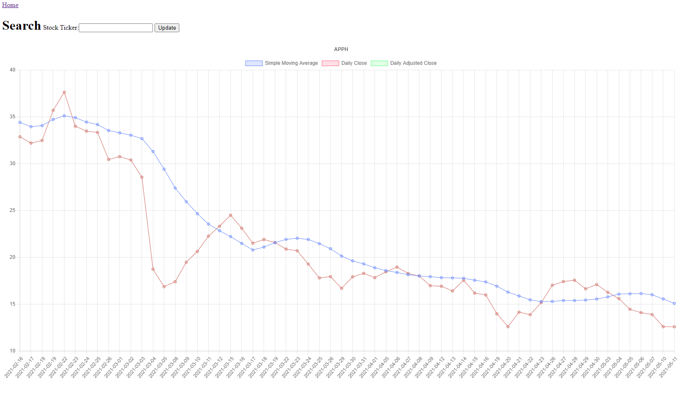

# Build a Stock Data Visualizer Web App Using Alpha Vantage + Django

In this tutorial we will build a simple web app to visualize stock data using Python (Django), Javascript, and the Alpha Vantage API. What we are going to visualize is Simple Moving Average, Daily Close, and Daily Adjusted Close for a given stock. 

## Daily Close vs. Daily Adjusted Close

If you are new to stocks you might be curious, what is the difference between Daily Close and Daily Adjusted Close? Daily Close is the last price that a stock was traded at for a particular day. Daily Adjusted Close is the last price that a stock was traded at for a particular day minus any corporate actions taken that would affect a stock price. That is to say that if a corporation pays dividends, splits their stock, issues rights, spins-off a new independent company ect. it is useful to discount the Daily Close price to account for this hidden value that was given to investors.

This tutorial is meant for an audience with a basic understanding of coding but it should also be valuable if you have no experience coding.

---

## Index

I've broken down our application into four main sections. In the Models section we will be creating a sqllite backend database. While this project could be done without a backend a database is essential to any modern web application. In the Views section we tell our application what to do when it recieves http requests. In the Templates section we create our html, css, and javascript. The Misc section covers settings and other housekeeping items.

- [Conventions](#Conventions)
- [Getting Started](#Getting)
- [Models](#Models)
- [Views](#Views)
- [Templates](#Templates)
- [Misc](#Misc)

This demonstration was done using Windows but the process will be similar for Mac or Linux.

---
## Conventions
A block that starts with a > indicates a command that should be run in your terminal or command prompt. Make sure you're running the terminal as Administrator.

	> pip install Django
	
Blocks that start with a # followed by a path indicate that we are working with (creating/editing) a file. I use Visual Studio Code but you can use any text editor or IDE of you choosing.

	#C:\Users\dppet\Desktop\alphaDjango\stockVisualizer\views.py

When working with larger files we will start by looking at the end product file without comments, then there will be a heading, then we will break the code down line by line.

---
## Getting Started
- [Get an Alpha Vantage API key](https://www.alphavantage.co/support/#api-key)
- [Install Python if you don't already have it](https://www.python.org/downloads/)
- Install Django
`> pip install Django`
- Install Requests
`> pip install requests`

Create a Windows Environment Variable for your apikey

	> setx alphavantage yourapikeygoeshere

Here is the Linux command if you aren't running Windows.

    > export alphavantage yourapikeygoeshere

## Quickstart

If you want to get right to the satisfying visualization and work you way backwards through the code/tutorial here is how you can do that. If you want to follow the code line by line skip this section.

    > C:\Users\dppet\Desktop\ git clone https://github.com/danpetrow/alphaDjango.git

    > C:\Users\dppet\Desktop\ python manage.py runserver

Create a project directory and the skeleton for your project.

    > C:\Users\dppet\Desktop\ django-admin startproject alphaDjango 

Let’s look at the skeleton startproject created for us:

    alphaDjango/
        manage.py
        alphaDjango/
            __init__.py
            settings.py
            urls.py
            asgi.py
            wsgi.py

Next open up your inner project directory.

    > C:\Users\dppet\Desktop\ cd alphaDjango

Create a new app

    > C:\Users\dppet\Desktop\alphaDjango python manage.py startapp stockVisualizer

Now we have another batch of new files:

    alphaDjango/stockVisualizer/
    __init__.py
    admin.py
    apps.py
    migrations/
        __init__.py
    models.py
    tests.py
    views.py
    urls.py # This will be made later. I've included this so you can see the overall file structure if you need.
    forms.py # This will be made later.
    templates/ # Created later on.

---
## Models
Define the structure of our database. This is our end product file without comments. Skip to the next heading for the deeper dive.

    #C:\Users\dppet\Desktop\alphaDjango\stockVisualizer\models.py\
    from django.db import models
    from django.urls import reverse

    class Stock(models.Model):
        symbol = models.CharField(max_length=12)

    def __str__(self):
        return self.symbol

    def get_absolute_url(self):
        return reverse('stock', args=[str(self.id)])

### Let's break this down

    #C:\Users\dppet\Desktop\alphaDjango\stockVisualizer\models.py\
    from django.db import models
    from django.urls import reverse

Create your models here.

    class Stock(models.Model):
        symbol = models.CharField(max_length=12)

If you're familar with SQL what we have done here is created a table called stock which has a column called symbol where we will store some data.

    def __str__(self):
        return self.symbol
Create a method that returns a string of the data in our symbol column.

    def get_absolute_url(self):
        return reverse('stock', args=[str(self.id)])
This creates a unique url for us to access each item in our database. 

---

Create a form from your database model.
	
	# C:\Users\dppet\Desktop\alphaDjango\stockVisualizer\forms.py
	from django import forms

	class StockForm(forms.Form):
		 symbol = forms.CharField(label\='Stock Ticker', max\_length\=12)

---

Instantiate your database

    > C:\Users\dppet\Desktop\alphaDjango python manage.py migrate

You should notice running this migrate command creates db.sqlite3 file in your base directory (C:\Users\dppet\Desktop\alphaDjango)

---

## Views

Your first view

    # C:\Users\dppet\Desktop\alphaDjango\stockVisualizer\views.py\
	from django.shortcuts import render
	from django.views.generic import UpdateView, CreateView, RedirectView
	from .forms import StockForm
	from .models import Stock
	import requests
	import os

	def home(request):
		try:
			stock = Stock.objects.all()
			data= list(Stock.objects.all())
			ticker = data[0]
			ticker = str(ticker).upper()
			apikey=os.getenv('alphavantage')
			sma = requests.get(f'https://www.alphavantage.co/query?function=SMA&interval=daily&time_period=10&series_type=close&symbol={str(data[0])}&apikey={apikey}').json()
			prices = requests.get(f'https://www.alphavantage.co/query?function=TIME_SERIES_WEEKLY_ADJUSTED&symbol={str(data[0])}&apikey={apikey}').json()

		except:
			stock = Stock.objects.all()
			data= list(Stock.objects.all())
			ticker = ''
			apikey=os.getenv('alphavantage')
			sma = ''
			prices = ''

		if request.method == 'POST':
			form = StockForm(request.POST)

    else:
        form = StockForm()

        return render(request, 'home.html',{
                'stock':stock,
                'ticker':ticker,
                'form':form,
                'sma':sma,
                'prices':prices,
				'apikey':apikey,
        })

	class StockView(RedirectView):
		url="/"

	class StockUpdateView(UpdateView):
		model = Stock
		fields = ['symbol']
		template_name = 'stock_edit.html'

	class StockCreateView(CreateView):
		model = Stock
		fields = ['symbol']
		template_name = 'stock_edit.html'

### Let's break this down

    # C:\Users\dppet\Desktop\alphaDjango\stockVisualizer\views.py\
	from django.shortcuts import render
	from django.views.generic import UpdateView, CreateView, RedirectView
	from .forms import StockForm
	from .models import Stock
	import requests
	import os

Create your views here.

	def home(request):
		try:
			stock = Stock.objects.all()
			data= list(Stock.objects.all())
			ticker = data[0]
			ticker = str(ticker).upper()
			apikey=os.getenv('alphavantage')
            
We use the os module to access our apikey which we have stored as an environmental variable /Views.py allows us to interact with the database. We are using a try statement in case our database is empty .Stock.objects.all() returns all of the entries in our model if they exist. 

			sma = requests.get(f'https://www.alphavantage.co/query?function=SMA&interval=daily&time_period=10&series_type=close&symbol={str(data[0])}&apikey={apikey}').json()
			prices = requests.get(f'https://www.alphavantage.co/query?function=TIME_SERIES_WEEKLY_ADJUSTED&symbol={str(data[0])}&apikey={apikey}').json()

We are going to use the requests package to get our data from the Alpha Vantage API.

		except:
			stock = Stock.objects.all()
			data= list(Stock.objects.all())
			ticker = ''
			apikey=os.getenv('alphavantage')
			sma = ''
			prices = ''

If this is a POST request we need to process the form data. POST is an http method that's used to add data to the backend.

		if request.method == 'POST':

Create a form instance and populate it with data from the request:

			form = StockForm(request.POST)

If a GET (or any other http method) we'll create a blank form

    else:
        form = StockForm()

        return render(request, 'home.html',{
                'stock':stock,
                'ticker':ticker,
                'form':form,
                'sma':sma,
                'prices':prices,
				'apikey':apikey,
        })

This dictionary is known as context in Django. It's useful to move data from the backend to your UI/frontend.

This function passes data from the frontend to the backend when a form is submitted. Also this passes data from our backend to our homepage when an http get request is made.

	class StockView(RedirectView):
		url="/"

When we post data to our database this class redirects us back to our homepage

	class StockUpdateView(UpdateView):
		model = Stock
		fields = ['symbol']
		template_name = 'stock_edit.html'

We will use this class to update our database Stock.symbol[0]

	class StockCreateView(CreateView):
		model = Stock
		fields = ['symbol']
		template_name = 'stock_edit.html'

When nothing exists this class creates Stock.symbol[0]

---

Your first URL
    
    #C:\Users\dppet\Desktop\alphaDjango\stockVisualizer\urls.py
    from django.contrib import admin # this isn't even completly required but nice to have to look at the db *1
	from django.urls import path
	from . import views

	urlpatterns = [
		path('admin/', admin.site.urls), # *1
		path('api/create/', views.StockCreateView.as_view(), name = 'stock_create'),
		path('api/ticker/<int:pk>', views.StockView.as_view(), name = "stock"),
		path('api/ticker/<int:pk>/edit/', views.StockUpdateView.as_view(), name = 'stock_edit'),
		path('', views.home, name = 'home')
	]

Creating a new path for our web app is simple. Just use Path('your-new-url/, The view we want to render defined in .views.py , ['optional:name'])

Your project's URLs
    
    #C:\Users\dppet\Desktop\alphaDjango\urls.py
    from django.urls import include, path

    urlpatterns = [
        path('', include('stockVisualizer.urls')),
    ]

Rather than using our base urls we include the urls defined in stockVisualizer.urls.

---

## Templates

 This section is wrapped with this raw tag because my website also uses Jinja and it would otherwise get confused.

Django uses a a technology called Jinja which allows you to write reusable html components. If you're familiar with html but see something like  or {{ stock }} just know this is Jinja.

Now let's make some html.

    > C:\Users\dppet\Desktop\alphaDjango\ mkdir templates
    > C:\Users\dppet\Desktop\alphaDjango\ cd templates
    > C:\Users\dppet\Desktop\alphaDjango\templates\ type nul >> "home.html" # this works will in powershell but might not work in command prompt
	
An html base
	
	# C:\Users\dppet\Desktop\alphaDjango\templates\base.html
	<!DOCTYPE html>
	<html lang="en" style="height: 100%; overflow:hidden;">
	<head>
		<!--<link rel="stylesheet" href="style.css">-->
		
		
		<title>My amazing site</title>
	</head>

	<body style='height: 100%;'>
		<nav><a href="/">Home</a></nav>
		
      
			
		

	</body>
	</html>

### Breakdown

	# C:\Users\dppet\Desktop\alphaDjango\templates\base.html
	<!DOCTYPE html>
	<html lang="en" style="height: 100%; overflow:hidden;">
	<head>
		<!--<link rel="stylesheet" href="style.css">-->
		
		

These two script tags reference CDNs (Content Delivery Network) which enable us to use chart.js and jQuery in our project without downloading those packages. 

        <title>AlphaDjango</title>
	</head>

	<body style='height: 100%;'>
		<nav><a href="/">Home</a></nav>
		
      
			
		

	</body>
	</html>

Base.html is a Jinja component which we will now be able to use in all of our html files so we can cut down on repetition.

---

Homepage html, css, and Javascript.

	# C:\Users\dppet\Desktop\alphaDjango\templates\home.html
	

	

    
    
        <h1>Search</h1>
        <form action =  method="post">
        {{ form.as_p }}
        <input type="submit" value="Update" />
        </form>
    

    
        
        

        

        <h1>Search</h1>
        

        

        <form action =  method="post" id="myForm" float='left'>
        {{ form }}
        <input type="submit" value="Update" />
        </form>
        

        

        
    
    

    <canvas id="myChart"></canvas>
    

    
	

### Breakdown

	# C:\Users\dppet\Desktop\alphaDjango\templates\home.html
	

	

    
    
        <h1>Search</h1>
        <form action =  method="post">
        {{ form.as_p }}
        <input type="submit" value="Update" />
        </form>
    

Here we use  which is a useful Jinja snippet. This snippet is a sort of flow control. You can read this like if there are no symbols in stock do the following. 

    
        
        

        

        <h1>Search</h1>
        

        

        <form action =  method="post" id="myForm" float='left'>
        {{ form }}
        <input type="submit" value="Update" />
        </form>
        

        

        
    

If we do have some data in stock then for the first symbol we want a form that will edit that. You should notice the differences in these two forms. The first form refers to our create-stock url which relates to our CreateView view. This form calls our stock_edit url, which uses our StockUpdateView class.

    

    <canvas id="myChart"></canvas>
    

This creates a canvas that we will edit with ChartJS in the script section.

    

This Javascript is very naive. It works, but ideally this would be actually be asyncronous Javascript. If you have a better way to accomplish this please make a pull request.

	
	
Html for editing our database
	
	# C:\Users\dppet\Desktop\alphaDjango\templates\stock_edit.html
	

	
			<h1>Search</h1>
			<form action = "" method="post">
			{{ form.as_p }}
			<input type="submit" value="Update" />
			</form>
	

 
---

## Misc

Now we need to edit one part of our settings to make the app work.
    
    #C:\Users\dppet\Desktop\alphaDjango\settings.py
    import os #add this
    ...
    INSTALLED_APPS = [
    ...
    'stockVisualizer', #add this
	]
	...
    TEMPLATES = [
		...
        {
        'DIRS': [os.path.join(BASE_DIR, 'templates')], #add this
        },
		...
    ] 

There will be plenty of other stuff in this file that you will not want to change. Make sure you just add these few changes. If you want to take a look at the whole file check it out via Github.

Tell Django that our app exists and that it uses our database. 

    # C:\Users\dppet\Desktop\alphaDjango\stockVisualizer\apps.py
    from django.apps import AppConfig

    class StockvisualizerConfig(AppConfig):
        default_auto_field = 'django.db.models.BigAutoField'
        name = 'stockVisualizer'
---
Congrats you've made a webapp with Python, Javascript, and Alphavantage! Run your application so we can take a look at your work.

	> C:\Users\dppet\Desktop\alphaDjango\ python manage.py runserver

Open up [http://localhost:8000/](http://localhost:8000/)